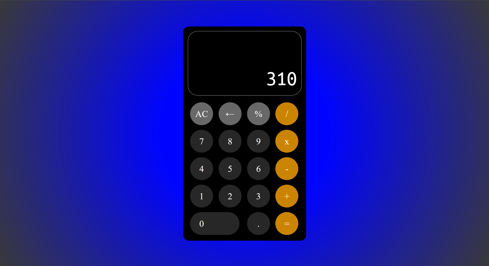

# TOP-Calculator
*Calculator* project from [The Odin Project](https://www.theodinproject.com/about) course

## Preview link
https://yurii-ruban.github.io/top-calculator

## Skills
 - HTML
    * Basic non-sementic markup
 - CSS
    * Using custom fonts
    * Grid-layout
 - Javascript
    * Working with primitive data types (strings, numbers)
    * Working with DOM by binding click events and displaying info
    * Objects, Map, Constructors

## Purpose
The Calculator project is the final project from Foundation course. It has to be done using native JS language, HTML and CSS without using any additional frameworks or libraries.
Main task is to practice more all acquired skills for markup, styling and basic js programming

## Screenshot

